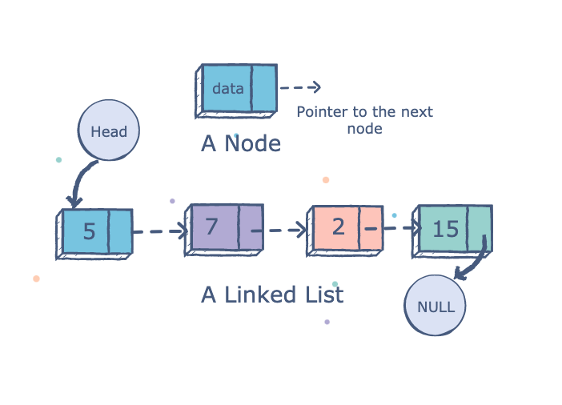

## Linked List

En linked list är en datastruktur uppbyggt av noder i linjär följd. Dessa noder länkas ihop med hjälp av pekare.

En nod består av två fält; ett informationsfält där data lagras och ett adressfält innehållande antingen adressen till nästa nod i listan eller till null.

Själva listan har förutom noderna, 3 egna attribut: **head**, **tail** och **längd**.
Head är först elementet på listan, vilken jämfört med ett fält hade varit *array[0]*, tail *array(array.length -1)* och längd *array.length*.

**Fördelar**
- Kan växa och minka i storlek efter behov, till skillnad från exempelvis ett fält
- Element kan läggas till och tas bort var som helst i listan

**Nackdelar**
- För att hitta en nod *n* måsta man tillämpa linjärsökning (**O(*n*)**) eftersom att det inte finns någon relation mellan en nods position i listan och minnesaddressen som den finns lagrad på

Linked List funkar bra ihop med andra datastrukturer så som **stack** och **queue**.
