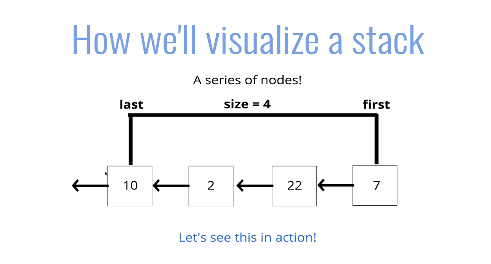
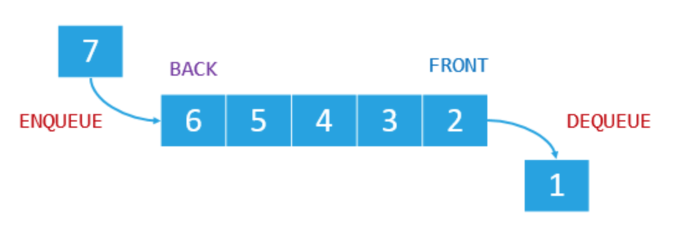

# Stacks and Queues

## Stacks



#### Vad är en Stack?

En linjär ordnad följd av element, som följer "sist in - först ut".

Tänk att du ska flytta från en lägenhet till ett hus och har hyrt en skåpbil på för detta ändamål. Eftersom att du har samlat på dig en hel del grejer och möbler genom åren kommer du endast att kunna nå det sist inträngda föremålet i skåpbilen när det väl är dags för utlastning.

I stort är det en stack som tillåter tre operation:

1. push()
2. pop()
3. peek()

Precis som vid ett flyttlass, även om vi inte fysiskt utför dessa operationer, så uppdaterar vi tidigare *sista* element att peka mot elementet vi lägger till, vid *push()*.

När vi lassar in ett föremål säg en stol, så ställer vi den längst bak. Tidigare var där ett piano. Så i princip så blir det som att vi har en minnesadress(next) från stolen till pianot för att säga att efter mig är du next på tur.

När vi lassar ut ett föremål så får vi ett nytt sista föremål. Tillvägagångssättet i en Stack blir att lagra föremålet sista föremålet, stolen som vi är i fart med att lyfta ur, och eftersom att vi har dess next attribut pekandes till pianot, så säger vi att pianot är next på kö (sista föremål).

När vi peekar öppnar vi bara skåpbilen och ser det värde (vilket föremål) det är som står där vilken med stack innebär att se vilket föremål som pekar mot *first*.
 

#### När används stacks?

- Hantering av function invocations (the call-stack)
- Undo/Redo i exempelvis Illustrator eller Photoshop
- Routing i browsern

Det finns fler än ett sätt att implementera en stack, det är ett abstrakt koncept; en generell ide av hur det ska gå till.

### Stack Array implementation

```javascript
var stack = [];

stack.unshift("create new file");
stack.unshift("Resize file");
stack.unshift("cloned out wrinkle");
stack.shift();

stack.push("create new file");
stack.push("Resize file");
stack.push("cloned out wrinkle");
stack.pop();
console.log(stack);
```

Det här är inget effektivt sätt att skapa en stack då fält kommer med index och behöver extra operationer för att ta bort ett element.

Måste man använda sig av ett fält är push/pop bättre, då dessa operationer ej är nödvändiga.

### Stack Linked List

1. Node
2. Stack
3. Push
4. Pop


   1. ##### Node

   > Skapa en nod med två egenskaper: innehåll och address till nästa nod.

   ```javascript
   class Node {
     constructor(value) {
    this.value = value;
    this.next = null;
     }
   }
   ```

   2. ##### class Stack

    > Skapa en Stack klass med tre egenskaper: first, last och size.


```javascript
class Stack {
  constructor() {
    this.first = null;
    this.last = null;
    this.size = 0;
  }
```

  3. ##### push

   > Lägg till en node på slutet av listan (ny last).

   **pseudokod**

- [ ] funktionen ska acceptera ett värde
- [ ] skapa en ny nod med det värdet
- [ ] om det ej finns någon nod i stacken, sätt first och last till ny nod
- [ ] om det finns minst en nod, skapa en variabel som lagrar den aktuella first på stacken.
- [ ] återställ first på stacken att vara nya noden
- [ ] sätt next på nya noden att vara föregånde skapade nod
- [ ] öka längden med en


```javascript
push(val) {
    var node = new Node(val);
    if (this.size === 0) {
      this.first = node;
      this.last = node;
    } else {
      var temp = this.first;
      this.first = node;
      this.first.next = temp;
    }
    return ++this.size; // return och incrementera this.size
  }
```

4. ##### pop

  > Radera senast inkomna nod.

​			**pseudokod**

- [ ] om det ej finns noder, return null
- [ ] skapa en tillfällig variabel för att lagra *first*
- [ ] om det endast finns en nod: sätt first och last att vara null.
- [ ] om det finns fler, sätt first på next att vara nuvarande first.
- [ ] minska med 1
- [ ] return värdet av borttagne node


```javascript
pop() {
    if (this.size === 0) return null;
    let temp = this.first;
    if (this.size === 1) {
      this.first = null;
      this.last = null;
    }
    this.first = temp.next;
    this.size--;
    return temp.value;
  }
```

## Kö (Queues)



### Vad är en kö?


En kö är en kö. En linjär datastruktur för lagring av data. Karaktäriseras av den data som stoppades in först är vad man få ut först; tänk en kö i en affär. Datan i kön manipuleras genom två operationer; enqueue och dequeue.

#### Användingsområden 

- Uppgifter som ska köras i backgrunden
- Uppladdningar
- Utskrifter


#### Implementering av en kö med ett fält.


```javascript
var q = [];

q.push("first");
q.push("second");
q.push("third");
q.shift();

// Bättre med tanke på att inga index behöver ändras när vi lägger till på slutet.

q.unshift("a");
q.unshift("b");
q.unshift("c");
q.pop();

console.log(q);
```

#### Linked List Queueu

1. Node
2. class Queueu
3. enqueue
4. dequeu
  
1. ##### Node
  > Skapa en nod med två egenskaper: innehåll och address till nästa nod.

```javascript
class node {
    constructor(value) {
        this.value = value;
        this.next = null;
    }
}
```

2. ##### class Queue
  > Skapa en vår Queueu class med tre egenskaper: first, last och size.
> 
```javascript
class Queue {
    constructor() {
        this.first = null;
        this.last = null;
        this.size = 0;
    }
}
```

3. ##### enqueue
  > Placera data sist i kön.

  			**pseudokod**

- [ ] metoden accpeterar ett värde
- [ ] skapa en node med värdet
- [ ] om det ej finns någon nod, sätt nod att vara first och last
- [ ] annars, sätt next på nuvarande last att vara nod, sätt sedan last att vara den noden

```javascript
  enqueue(val) {
    let node = new Node(val);
    if (this.size === 0) {
      this.first = node;
      this.last = node;
    } else {
      this.last.next = node;
      this.last = node;
    }
    return ++this.size;
  }
```
4. #### dequeue
  > ta bort data främst i kön.

   **pseudokod**

- [ ] om det ej finns nodes, return null
- [ ] skapa en tillfällig variabel för att lagra first
- [ ] om det endast finns en node sätt first och last att vara null
- [ ] om det finns fler, sätt first på next att vara nuvarande first
- [ ] minska med size med 1
- [ ] return värdet av borttagna node

```javascript
     dequeue() {
    if (!this.first) return null;

    var temp = this.first;
    if (this.first === this.last) {
      this.last = null;
    }
    this.first = this.first.next;
    this.size--;
    return temp.value;
  }
```

