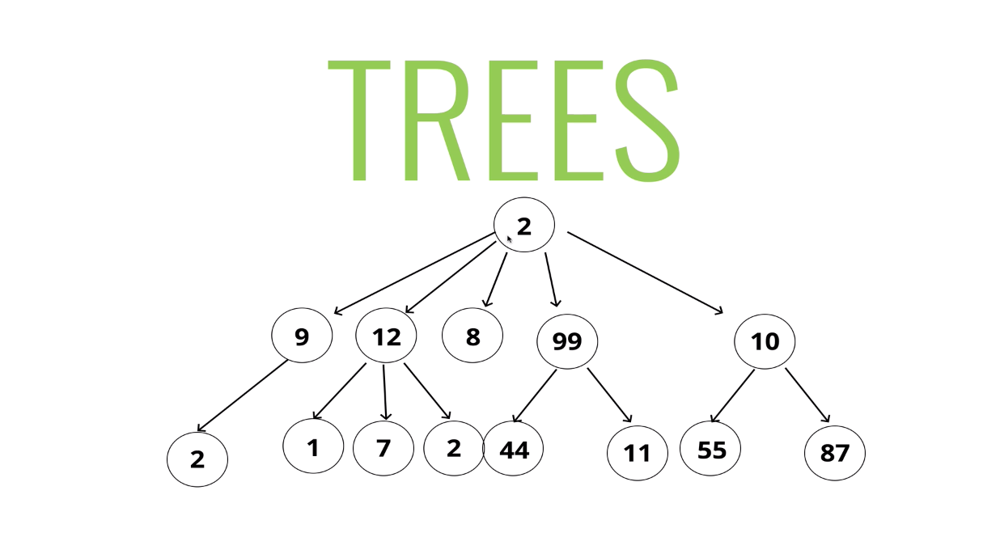
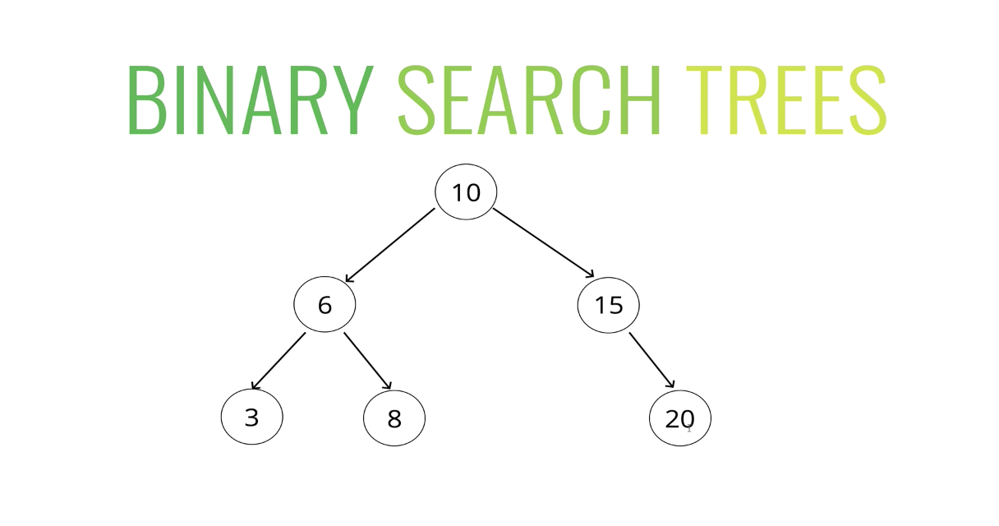
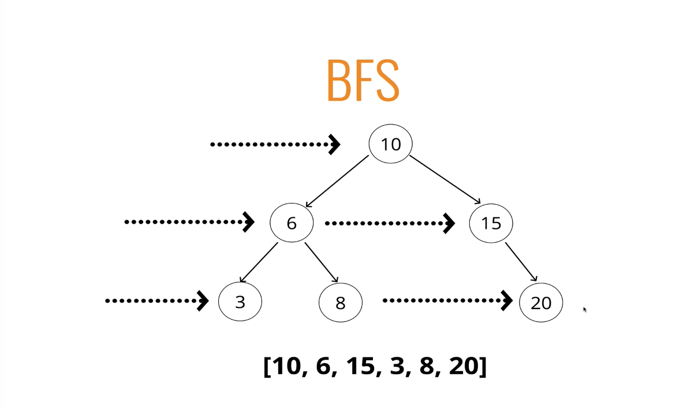
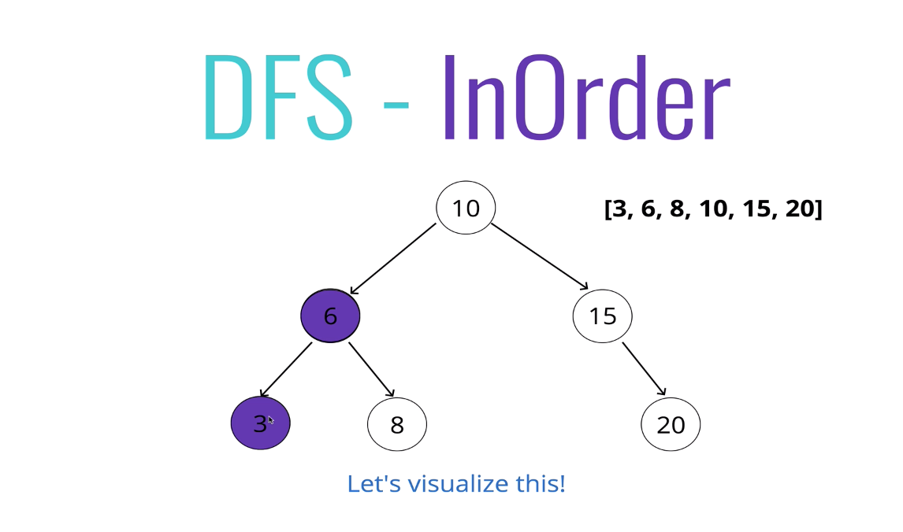
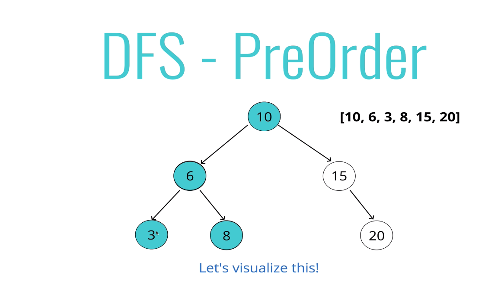
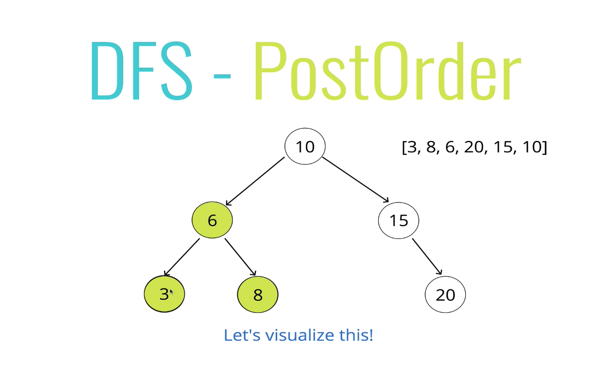
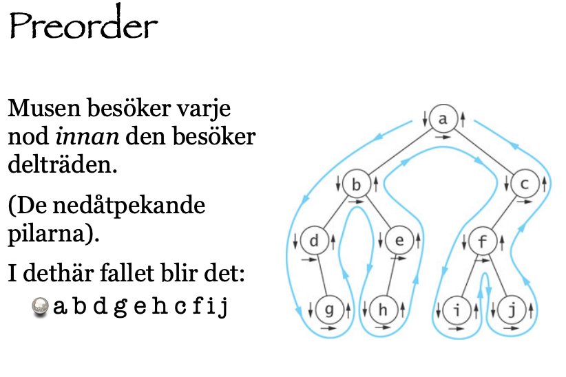
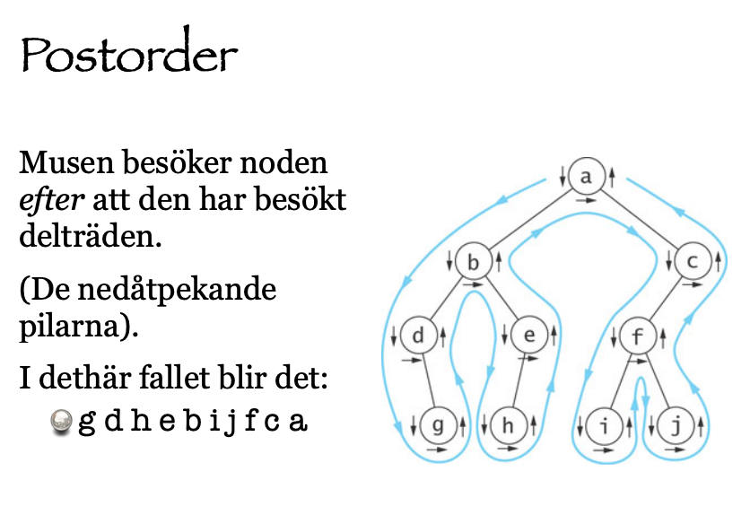
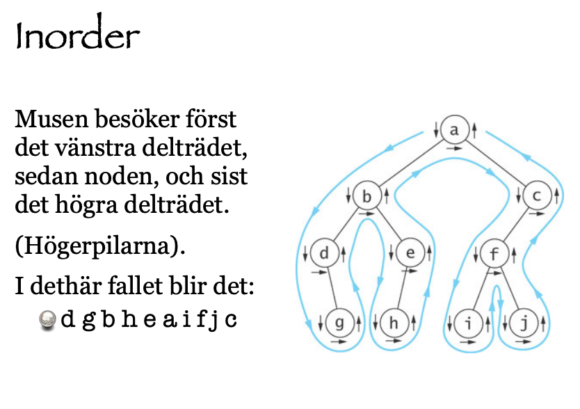

# Träd




### Binärt träd

En vanligt använd datastruktur som ordnar element i en hierarki.
Rotnoden är den första, översta, noden i trädet och den enda nod som inte har några grenar som leder in. Från rotnoden finns det exakt en väg till varje nod i trädet.

De nodar som kan ta sig till från rotnoden kallas för dess barn, eller *direkta föregångare*. De noder som har samma förälder kallas för *syskon*.
En nod kan som mest ha en förälder

Rotnoden ligger på nivå 0 och dess barn på nivå 1

Ett fullt träd är ett träd där alla inre noder är fulla, det vill säga har maximalt antal barn (så många som trädets grad), och där alla löv ligger på samma nivå. Om en ny nod läggs till i ett fullt träd så ökar trädets höjd (med 1).

Storleken på ett träd räknas i antal noder.

Ofta, vilket vi kommer att se i vårt *Binary Search Tree*-exempel, är träd *orienterade* vilket betyder att varje nods barn är sorterat.

Om ett träds grad är 2 eller 3 (bredd) kan vi tala om vänster- och högerbarn (och även mittenbarn). Ett närmaste syskon är endera det högersyskon eller det vänstersyskon som endast är ett steg ifrån.

Där listor är linjärna datastrukturer är träd icke-linjära.

###  Terminologi

Rotnoden - Root. Noden utan förälder. Kan endast finnas en rotnod.
Förälder - Parent - Noden ovanför som har en riktad kant till den aktuella noden.
Barn - Child - En nod under den aktuella noden som vi har en riktad kant till. 
Syskon - Siblings - Noderr med samma fölrälder.
Löv - Leaf - En nod utan barn.
Riktad kant - Edge - Sammankopplingen mellan en nod och ett barn.
Djupet - Steg för en nod att ta sig från rotnoden till noden. Rotnoden har djup 0 och dess barn 1, osv.
Höjden - för trädet är det största djupet i trädet. Ett träd med bara en rotnod har höjd 0.


### Användning för trees
- HTML DOM 
- Network routing
- Abstract syntax trees
- Artificial Intelligens
- JSON
- Binärt sökträd

### Vanliga operationer
-Uppräkning av alla element
- Uppräkning av alla element i en viss del av trädet
- Sökning
- Lägga till ett element på en viss position i trädet
- Borttagning av ett element (och dess nod)
- Borttagning av ett delträd (ansning)
- Lägga till ett delträd (ympning)

### Typer av träd
- Trees
- Binary Trees
- Binary Search Trees

<hr>

### Binärt sökträd

Ett binärt söktträd där varje nod innehåller ett värde från en ordnad mängd.
Här gäller följande:
Samtliga noder i det vänstra delträdet till *n* innehåller värden som är mindre än värdet i noden *n* och vice versa för det högra.




- Kan precis som som Binära träd ha noder som mest ha 2 barn
- Vad som är speciellt är att Binary Search Tree är lagrad i en speciell ordning
- Är till för att lagra data som kan jämföras.

Såhär fungerar det:
- Varje parent har som mest två children
- Varje node till vänster av parent är alltid mindre än parent
- Varje node till höger är alltid större än parent


#### Sökning

Att söka i ett binärt sökträd kan göras väldigt effektivt då trädet har skapats för att göra just detta. Om vi börjar vi rotnoden har vi 3 vägar att vandra: är värdet större än rötnoden hittar vi värdet i högre delträdet, är det mindre hittar vi det i det vänstra. Är det lika stort så har vi redan där hittat det vi söker. Har vi inte hittat det vi söker gå vi bara ner till nästa nod och ställer samma frågor.

#### Traversering
Att genomsöka alla noderna i träd kallas att traversera trädet, vilket vi kommer att gå in på senare.

#### Insättning
Även detta är en snabb operation. Den går till som så att vi gör insättningen vid den första ledig lövnoden, därefter görs vanligtvis en sortering av trädet så att eventuella rotationer för att balansera trädet kan utföras.


### Binary Search Tree

Implementering
1. Nod
2. class BinarySearchTree
3. insert
4. find
5. contains
   
1. Nod
> Skapa en nod med tre egenskaper: innehåll och två addresser till högra och vänstra nod.

```javascript
class Node {
  constructor(value) {
    this.value = value;
    this.left = null;
    this.right = null;
  }
}
```

2. ##### class BinarySearchTree
> Skapa en klass med ett attribut: vilken root den har med initialt värde null.

```javascript
class BinarySearchTree {
  constructor() {
    this.root = null;
  }
}
```

3. ##### inserting
> Tanken är att trädet ska veta var nodens plats skall vara.

 **pseudokod**

- [ ] skapa en ny nod
- [ ] börja vid root
- [ ] finns det någon root? Om inte, root är nu ny nod
- [ ] om det finns en root, kolla om värdet på nya nod är större eller mindre än värdet på root
- [ ] om det är större
- [ ] 1. kolla om det finns en nod till höger
      2. om det finns, flytta den noden, repetera dessa steg
      3. Om inte, låt nya noden vara right
- [ ] Om det är mindre
- [ ] 1. kolla om det finns en node till vänster
      2. om det finns, flytta den noden, repetera dessa steg
      3. om inte, låt nya noden vara left

```javascript
 insert(value) {
 let node = new Node(value);

 if (!this.root) {
   this.root = node;
   return this;
 }
 let current = this.root;
 while (true) {
   if (value === current.value) return undefined;

   if (value < current.value) {
     if (!current.left) {
       current.left = node;
       return this;
     }
     current = current.left;
   } else {
     if (!current.right) {
       current.right = node;
       return this;
     }
     current = current.right;
   }
 }
```


4. ##### find
> Se om ett värde finns i trädet.
> 
   ** pseudokod**
- [ ] börja vid roten.
- [ ] finns det någon rot? om inte, då har vi sökt klart.
- [ ] om det finns en rot, kolla om värdet på nya noden är är värdet vi letar efter. Om det är det är vi klara.
- [ ] om inte, kolla om värdet är större eller mindre än roten.
- [ ] Om det är större
  1. kolla om det finns en nod till höger
  2. om det finns, flytta till den noden, repetera dessa steg
  3. Om inte är vi klara
- [ ] Om det är mindre
  1. kolla om det finns en node till vänster
  2. om det finns, flytta till den noden, repetera dessa steg
  3. om inte är vi klara
   
```javascript
find(value) {
    if (!this.root) return false;
    var current = this.root,
      found = false;
    while (current && !found) {
      if (value < current.value) {
        current = current.left;
      } else if (value > current.value) {
        current = current.right;
      } else {
        found = true;
      }
    }
    if (!found) return undefined;
    console.log(current);
    return current;
  }
  ```

5. contains
   
   ```javascript
   contains(value) {
    if (!this.root) return false;
    var current = this.root,
      found = false;
    while (current && !found) {
      if (value < current.value) {
        current = current.left;
      } else if (value > current.value) {
        current = current.right;
      } else {
        console.log("yes");
        return true;
      }
    }
    return false;
  }
    ```

# Tree Traversal

### Traversering
Att genomsöka alla noderna i ett träd kallas att traversera trädet. Detta kan göras genom post-, pre- eller inordertraversering.
Om inordertraversering appliceras på ett binärt sökträd fås elementen i växande ordning.

#### Breadt-first Search



#### Depth-first Search

###### DFS- InOrder



###### DFS - PreOrder



###### DFS - PostOrder




## Breadth-first Search


```javascript
 bfs() {
    let data = [];
    let q = [];
    let node = this.root;

    q.push(node);
    while (q.length) {
      node = q.shift();
      
      data.push(node.value);
      if (node.left) q.push(node.left);
      if (node.right) q.push(node.right);
    }
    return data;
  }
```

### Depth-First Search

  För varje tree traversal kan vi bryta ned till 3 steg:
  1. Vi måste besöka varje node
  2. Utforska hela left
  3. Utforska hela right


### Pre Order




Börja med root. Gå igenom hela left side. Gå seden igenom hela right. Och det gäller för varje nod.

steg - recursive

1. Skapa en variabel att lagra värden på de nodar vi har besökt
2. Lagra root i current
3. Skriv en helper funktion som accepterar en node
    - Push värdet på noden till variabeln som lagrar värden
    - Om noden har left, call helper funktioner med .left på noden
    - Om noden har right, call helper funktioner med .right på noden
4. Invoke the helper function med current
5. return values array

```javascript
DFSPreOrder() {
    let data = [];

    function traverse(node) {
      data.push(node.value);
      if (node.left) traverse(node.left);
      if (node.right) traverse(node.right);
    }
    traverse(this.root);
    console.log(data);
    return data;
  }
```

### Post Order



steg - recursive

1. Skapa en variabel att lagra värden på de nodar vi har besökt
2. Lagra root i current
3. Skriv en helper funktion som accepterar en node
    - Om noden har left, call helper funktioner med .left på noden
    - Om noden har right, call helper funktioner med .right på noden
    - Push värdet på noden till variabeln som lagrar värden
    - Invoke the helper function med current
4. return values array

```javascript
 DFSPostOrder() {
    let data = [];
    function traverse(node) {
      if (node.left) traverse(node.left);
      if (node.right) traverse(node.right);
      data.push(node.value);
    }
    traverse(this.root);
    console.log(data);
    return data;
  }
```
### InOrder




1. Skapa en variabel att lagra värden på de nodar vi har besökt
2. Lagra root i current
3. Skriv en helper funktion som accepterar en node
    - Om noden har left, call helper funktioner med .left på noden
    - Push värdet på noden till variabeln som lagrar värden
    - Om noden har right, call helper funktioner med .right på noden
4. Invoke the helper function med current
5. return values array

```javascript
DFSInOrder() {
    let data = [];
    function traverse(node) {
      node.left && traverse(node.left);
      data.push(node.value);
      node.right && traverse(node.right);
    }
    traverse(this.root);
    console.log(data);
    return data;
  }
```

### När ska vi använda oss av vad?

Beror helt på trädet.

När vi implementerar BFS använder vi oss av en queue vilket innebär lagring av extra minne så om vi har ett väldigt brett träd så kan det påverka platskomplexitet. Tidskomplexitet är ungefär det samma.

På samma sett om det är ett väldigt djupt träd så kan DFS ta upp mycket plats.

Nu till de olika varianterna av DFS:

**InORDER**

När vi använder InOrder på ett binärt sökträd, om vi ser på datan vi får tillbaka kan vi se att den är sorterad.

**PreOrder**
Här får vi tillbaka datan i hur den är uppbyggd i trädet, så bra om vi vill kopiera eller duplicera ett träd.

### Sammanfattning
Träd är icke-linjära data strukturer som innehåller förälder- och barn-noder.
Binära träd kan ha värden av alla typer, men som mest två barn per förälder.
Binära sökträd är en mer specifik version av binära träd där varje nod till vänster om föräldern har ett värde mindre än föräldern och vice versa för högersidan.
Vi kan söka igen, eller traversera genom träd, antingen genom BFS eller DFS.


